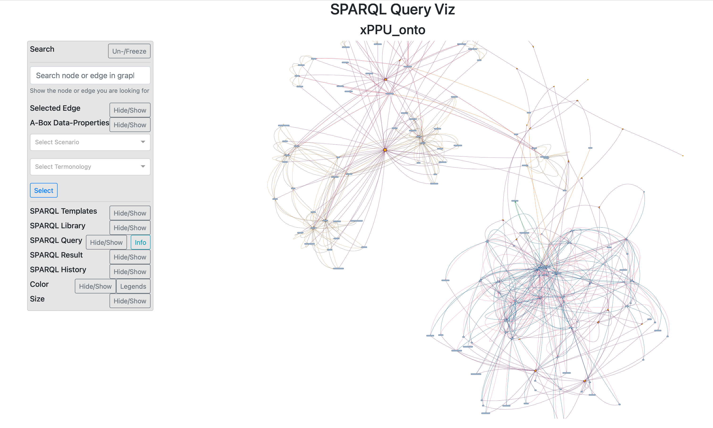

*Your interactive ontology visualizing and SPARQL query formulation tool*
**xPPU Scenario Version**

[[_TOC_]]

## What is *SPARQL Query Viz*

*SPARQL Query Viz* is a python based interactive ontology visualizing tool, that supports you to compose SPARQL queries interactively. 

The interactive graph gives an overview over the structure of the ontology at hand. The visualization can be adjusted to your needs by tweaking the visualization option, by coloring and sizing of the graph elements and by turning on/ off the *ABox* visualization.

*SPARQL Query Viz* provides an interactive query formulation panel, that enables you to compose and evaluate queries. Templates and interactive composition techniques support particularly lay users in query formulation.

This codebase of the SPARQL Query Viz is an adaptation of the original version with special adaptations for the *xPPU Ontology*.
## Installation

1. Clone the repo from GitLab
2. Set up a virtual environment, by using `python -m venv myenv` and activate the env:
    - (Windows) `.\\myvenv\\Scripts\\activate.bat`
    - (Linux & MacOS) `source myvenv/bin/activate`
3. Install all relevent dependencies by running `pip install -r requirements.txt`

## Getting started

To visualize the *xPPU Ontology*, the file `SPARQLQueryViz_run_use_case.py` has to be executed.
To do this run `python SPARQLQueryViz_run_use_case.py` in the directory where the corresponding file is located.
Alternatively the following two lines of code also do the job:

```python
from sparql_query_viz import SQV

sqv = SQV(iri="http://example.org/onto-ex.owl", path="sparql_query_viz/datasets/ontologies/xPPU_onto.owl", abox=True)
sqv.plot(host="127.0.0.1", port=8050, directed=True, vis_opts="small")
```

1. The main visualization class `SQV` is imported. 
2. `SQV` is initialised by passing the following optional arguments to the constructor:
    - `iri`: The *Internationalized Resource Identifier* of the ontology
    - `path`: The path to the ontology file
    - `abox`: The option to turn on or off the visualization of the *ABoxes* in the ontology
3. The `plot` method of `SQV` is called with the following optional arguments_
    - `host`: The host of the `Dash`-app
    - `port`: The port of the `Dash`-app
    - `directed`: The option to visualize the edges with arrowheads
    - `vis_opts`: The option to pass additional visualization options to the `visdcc`-graph

Note, that all the arguments are optional. The default values for these arguments are the same as passed to the functions in the example above. Except for the argument `vis_opts` in the `plot` method: The default value here is `vis_opts = None `. Passing the keyword `"small"` adjusts the visualization options for small ontologies.

After running the plot, the console will prompt the default localhost address (`127.0.0.1:8050`) where *SPARQL-Query-Viz* is running. Access it to see the following dashboard:



## Features

Currently, the dashboard consist of following components:
1. **GUI panel:** here the ontology data can be explored, it further contain following sections:
    - **Search:** can be used to find a node in graph
    - **Selected Edge:** shows the meaning of an edge that is selected
    - **A-Box Data-Properties:** shows the instantiated data properties of an instance that is selected (This section is invisble when no *ABoxes* are visualized)
    - **Select Scenario:** selection of a xPPU scenario and terminology. A corresponding query gets generated dynamically
    - **SPARQL Templates:** provides templates for common SPARQL queries
    - **SPARQL Library:** provides inconsistency checking queries for the use-case ontology
    - **SPARQL Query:** provides options to interactively compose SPARQL queries and shows the currently formulated query
    - **SPARQL Result:** shows the result of evaluated queries and provides a slider to adjust the context of the result visualization
    - **SPARQL History:** shows an adjustable number of successfully evaluated queries
    - **Color:** provides options to color node and edges (is activated per default) and optionally shows the color legend
    - **Size:** provides options to size node and edges (is activated per default)

2. **Graph:** the ontology visualization or the query result visualization (if query was evaluated)

## Extra settings

### Turn off *ABox* visualization

By default, the *ABoxes* of an ontology are displayed in the graph. To disable the *ABox* visualization, `abox = False` has to be passed to the `SQV` constructor:

```python
# turn of abox visu
from sparql_query_viz import SQV
jl = SQV(iri = "http://example.org/onto-ex.owl", path = "sparql_query_viz/datasets/ontologies/pizza", abox = False)
```

### Plot undirected graph

By default, `SQV` plots directed edges for the ontology visualization. This setting can be changed by,

```python
from sparql_query_viz import SQV
SQV().plot(directed = False)
```

### Tweak visualization options

The visualization options of the `vis.js` related visualization settings, can be tweaked to your needs. 

The default is `vis_opts = None`. Thereby *SPARQL-Query-Viz* takes the predefined settings for visualising large ontologies.

For small ontologies it is useful to use the predefined visualization options for small ontologies, by passing `vis_opts = "small"`:

```python
from sparql_query_viz import SQV
SQV().plot(vis_opts="small")
```
To adjust the visualization settings further, additional options can be passed like shown in the example below:

```python
from sparql_query_viz import SQV
SQV().plot(vis_opts={'height': '600px', # change height
                                      'interaction':{'hover': False}, # turn off the hover 
                                      'physics':{'stabilization':{'iterations': 100}}}) # define the convergence iteration of network

```

For a complete list of settings, visit [vis.js website](https://visjs.github.io/vis-network/docs/network/).

### Adjust Port

If you are facing port related issues, try the following way to run *SPARQL-Query-Viz*:

```python
from sparql_query_viz import SQV
port=8050
while True:
    try:
        SQV().plot(port=port)
    except:
        port+=1
```

## Requirements

*SPARQL Query Viz* requires the following python packages, 
1. Dash
    - dash_core_components
    - dash_html_components 
2. dash_bootstrap_components
3. dash_daq
4. visdcc
5. ontor
6. pandas


## License

*SPARQL-Query-Viz* is licensed under the terms of the MIT License (see the file
LICENSE).
